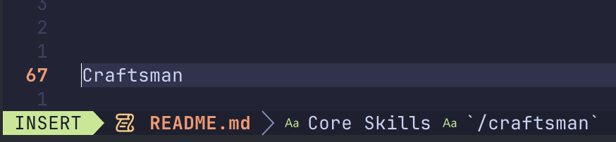
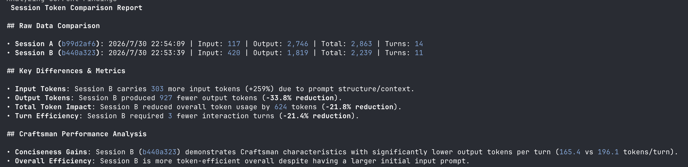

<p align="center">
  
</p>

<p align="center">
  <strong>Craftsman</strong>
</p>

<p align="center">
  Wrok with your skills. Make agent shut up & focus on the work.<br>
  No yapping. Zero noise. High signal.
</p>

---

Craftsman is for optimize agents output and token.
1. stop all nonsense
2. stop greetings
3. stop step-by-step explanations
4. outputting only the most concise and professional bullet points or code.

## Suggest use

```
/implement with /craftsman impl the user interface with following struct. 
```

### `/craftsman`
after skills applied, the Agent's output will be extremely compressed:
- Rejects all conversational filler
- Rejects step-by-step explanations, providing only final results or code
- Strictly uses bullet points
- **Usage**: Use alone, or combine with other commands, like `/commit with /craftsman`. You can also add it to `CONTEXT.md` to make it a persistent project rule.

## Testing Report

<p align="center">
  
</p>


## Other core skills

### `/craftsman-write-skills`
Helps you write or refactor high-quality Skills. It inherits the craftsman spirit:
- Emphasizes Process Predictability
- Strictly enforces a Zero-Noise Output Contract
- Eliminates ambiguous phrasing and redundant words

## Installation

Use the `install.sh` shell script or use `npx skills@lates kokp520/craftsman` to apply.


Craftsman

